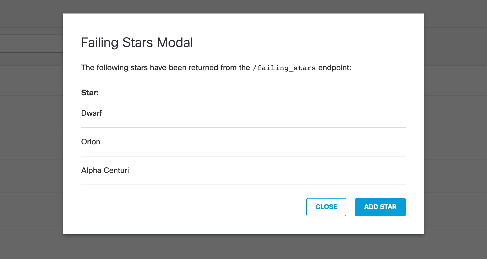

# Voltron

https://voltron-react-priya.herokuapp.com/

## Instructions:

- After cloning project run `yarn install`
- `yarn start` to run the app in development mode
- `yarn run test` to run jest tests
- `yarn run cypress` to open cypress
- `yarn run e2e` to run cypress end-to-end tests

### App Instructions:

- Build a modal popup

 

- When you click the “Add Stars” button on the modal, it hits an endpoint that returns a “star” as a JSON object 
- The endpoint is here - https://starscape.voltron-eng.com/failing-stars
- The modal keeps track of the last three stars retrieved and displays the names returned.  Please duplicate this functionality with a method of your choosing (cookies, localstorage, db, etc)
- Write Unit Tests using Jest and Enzyme 
- Write End-To-End tests using Cypress

### Extra Credit:

 - Use Redux for state management
 - Use SASS/SCSS
 - Don’t use a React boilerplate or create-react-app
 - Dockerize your code
 
 ### Design Solution 
 
 1. API design (Express App)
     - Uniform Interface
       - Uri format
         - GET `/entities` (to get all entities)
         - GET `/entities/:id` (to get a particular entity)
         - POST `/entities` (to get create an entity)
         - PUT `/entities/:id` (to update an entity)
         - DELETE `/entities/:id` (to delete an entity)
     
     - Caching (HTTP Headers)
        - Content-Type
        - Access-Control-Allow-Origin: *
        - Cache-Control vs Expires
        - ETag
        
     - HTTP Status Codes
        - 1xx Informational
        - 2xx Success 
            - 200 OK
            - 204 No Content
        - 3xx Redirection
        - 4xx Client errors 
            - 401 Unauthorized
            - 403 Forbidden
        - 5xx Server error 
        
 2. Data Store
    - Redux Architecture 
        - store 
        - actions 
        - reducers 
        - use separate reducer for every functionality  
        
 3. Component design
    - business functionality 
    - component re-use
    - container vs presentational components
 
4 Why use localstorage ?
   - data is persisted until the user manually clears the browser cache
   - Session storage: data is persisted only until the window or tab is closed
   - Cookies:
      1. data does not have to be sent back and forth with every HTTP request
      2. reduces the overall traffic between the client and the server and the amount of wasted bandwidth

 ### Possible Improvements 
 
 1. Reduce boilerplate code
 2. Save state to localStorage whenever the user ends their session, either by leaving the app (‘unmounting’ the component) or refreshing the page. `componentWillUnmount` does not fire when the user refreshes or leaves the page, utilize `window.onbeforeunload` event to save to localStorage
 3. `Expires` headers tell the browser whether they should request a specific file from the server or whether they should grab it from the browser's cache
    - Reduce server load
    - Decrease page load time
    - Or use `Cache-control` and provide max-age